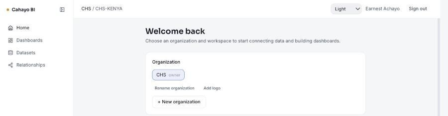
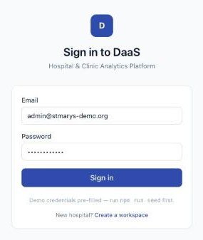
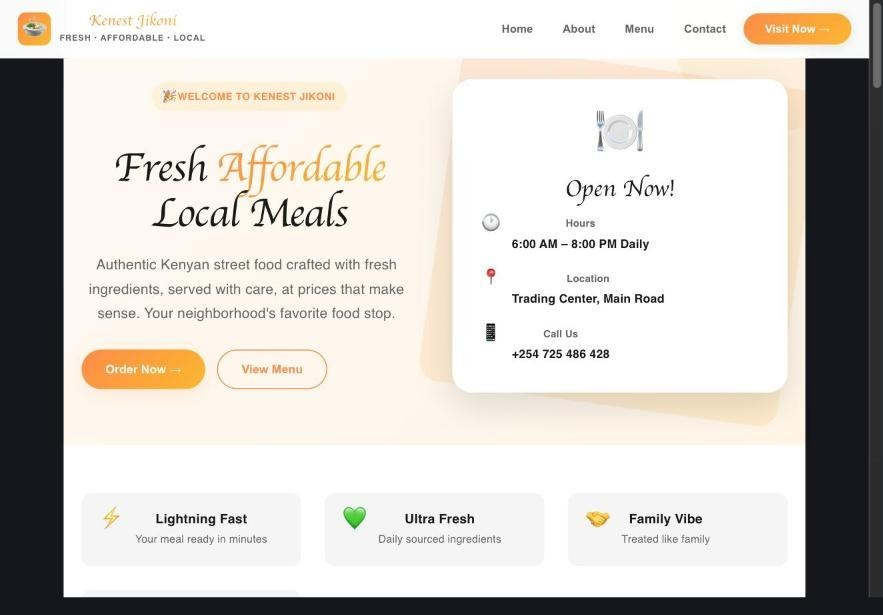
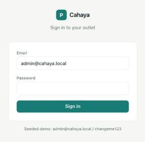
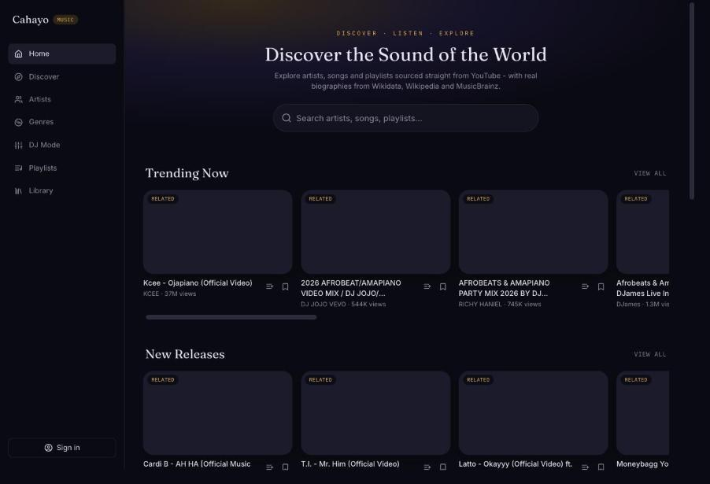
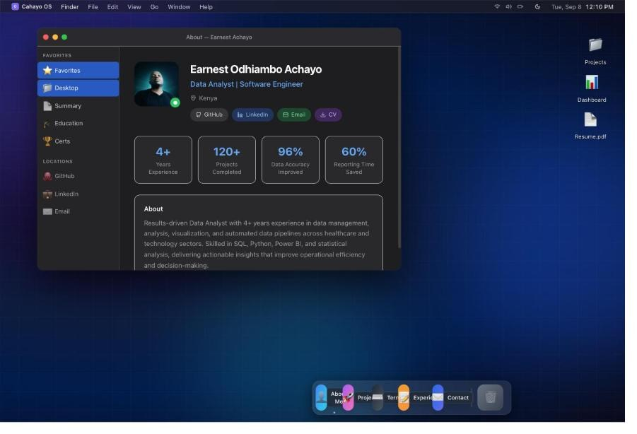
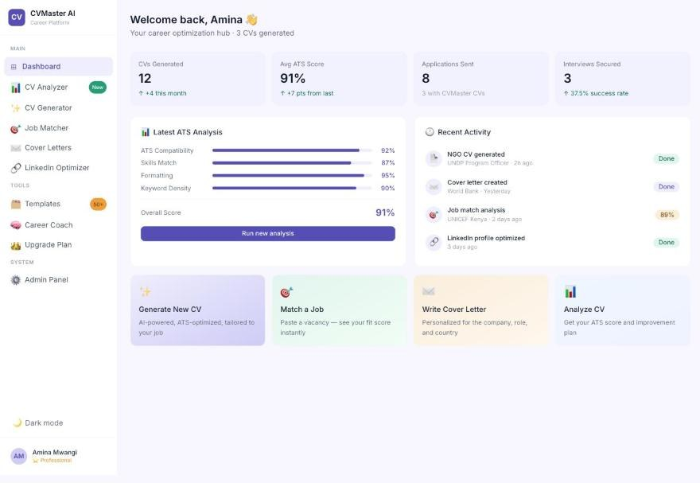
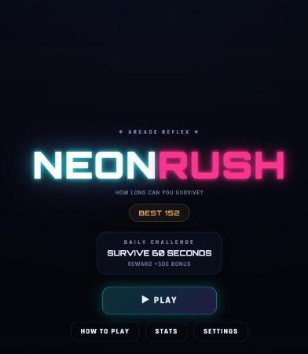

  
  
  
  

### 👋 About Me

I'm a full-stack software engineer based in Nairobi, Kenya, building end-to-end platforms across fintech, healthcare, hospitality, and edtech. I'm comfortable owning a product from schema design through deployment — Elixir/Phoenix and Django/Python on the backend, Next.js/React on the frontend, with real integrations (M-Pesa Daraja, payments, real-time channels) rather than mock data.

- 🏗️ Currently building multi-service platforms (BI, ITSM, LMS, HMS) with Elixir/Phoenix + Next.js
- 💳 Experienced with M-Pesa Daraja API integrations for Kenyan fintech products
- 🌱 Exploring AI-assisted analytics and applied ML (crop disease detection, AI-ready BI)
- 💼 Open to remote & contract software engineering work
- 📫 Reach me at **earnytech@live.com**

 

### 🛠️ Tech Stack

 

### 🚀 Featured Projects

<table>
<tr>
<td width="50%" valign="top">

<h4>Cahayo BI</h4>

AI-ready business intelligence platform — connect data sources, model it, and build interactive dashboards

<b>Stack:</b> Next.js · Node · PostgreSQL

<a href="https://cahayo-bi-frontend.onrender.com">Live Demo</a> · <a href="https://github.com/AchayoEarnest/cahayo-bi">Code</a>

</td>
<td width="50%" valign="top">

<h4>DAAS</h4>

Hospital &amp; clinic analytics platform for healthcare data insights

<b>Stack:</b> Next.js · TypeScript

<a href="https://daas-weld.vercel.app">Live Demo</a> · <a href="https://github.com/AchayoEarnest/DAAS">Code</a>

</td>
</tr>
<tr>
<td width="50%" valign="top">

<h4>Kenest Jikoni</h4>

All-in-one hotel + kitchen management platform with real-time housekeeping and reservations

<b>Stack:</b> Elixir/Phoenix · Next.js 15 · PostgreSQL · Redis

<a href="https://kenest-jikoni.vercel.app">Live Demo</a> · <a href="https://github.com/AchayoEarnest/kenest-jikoni">Code</a>

</td>
<td width="50%" valign="top">

<h4>Pharmly</h4>

Inventory management system with point-of-sale for pharmacies and retail

<b>Stack:</b> Next.js · PostgreSQL

<a href="https://pharmly-tau.vercel.app">Live Demo</a> · <a href="https://github.com/AchayoEarnest/pharmly">Code</a>

</td>
</tr>
<tr>
<td width="50%" valign="top">

<h4>Cahayo Music</h4>

Music discovery platform built on real data — YouTube Data API + Wikidata/MusicBrainz artist bios, no scraping or fabricated content

<b>Stack:</b> Next.js · YouTube API · Wikidata

<a href="https://cahayo-music.vercel.app">Live Demo</a>

</td>
<td width="50%" valign="top">

<h4>Cahayo Mac OS Portfolio</h4>

An interactive, macOS-styled portfolio site as a UI/UX showcase

<b>Stack:</b> React · CSS

<a href="https://cahayo-mac-os-portfolio.vercel.app">Live Demo</a> · <a href="https://github.com/AchayoEarnest/cahayo_mac_os_portfolio">Code</a>

</td>
</tr>
</table>

| Project | Description | Stack | Links |
|---|---|---|---|
| **ITSM Platform** | Microservices IT Service Desk & engineering operations platform — event-driven, one database per service | Elixir/Phoenix · Next.js 15 · PostgreSQL · Redis | [Code](https://github.com/AchayoEarnest/itsm-platform) |
| **Kenest Hotel HMS** | Hotel management system covering bookings, rooms, and guest operations | Full-stack web app | [Code](https://github.com/AchayoEarnest/kenest-hotel-hms) |

<b>📂 More Projects</b>

 

| | Project | Description | Links |
|---|---|---|---|
| | Finance Tracker | Personal finance tracking app | [Code](https://github.com/AchayoEarnest/finance-tracker) |
| | Luo Times | A Luo-language blogging & news platform | [Live Demo](https://luo-times.vercel.app) · [Code](https://github.com/AchayoEarnest/luo-times) |
|  | CVMaster | CV/resume builder web app | [Live Demo](https://cvmaster-opal.vercel.app) · [Code](https://github.com/AchayoEarnest/cvmaster) |
| | Community Intervention App | Tracks community services provided to adolescent girls and boys | [Code](https://github.com/AchayoEarnest/community_intervention_app) |
| | Daraja Docs | Documentation platform for Safaricom's M-Pesa Daraja API | [Code](https://github.com/AchayoEarnest/daraja-docs) |
|  | Neon Rush | A browser-based arcade game | [Live Demo](https://neon-rush-wheat-two.vercel.app) · [Code](https://github.com/AchayoEarnest/neon-rush) |

 

### 📊 GitHub Stats

  
  

  

*Thanks for stopping by — let's build something.*

